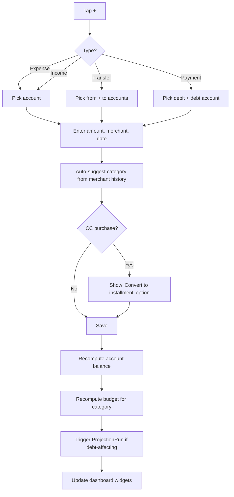
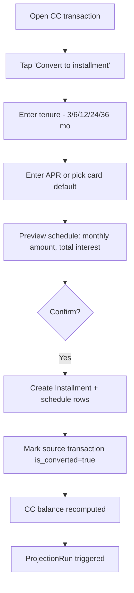
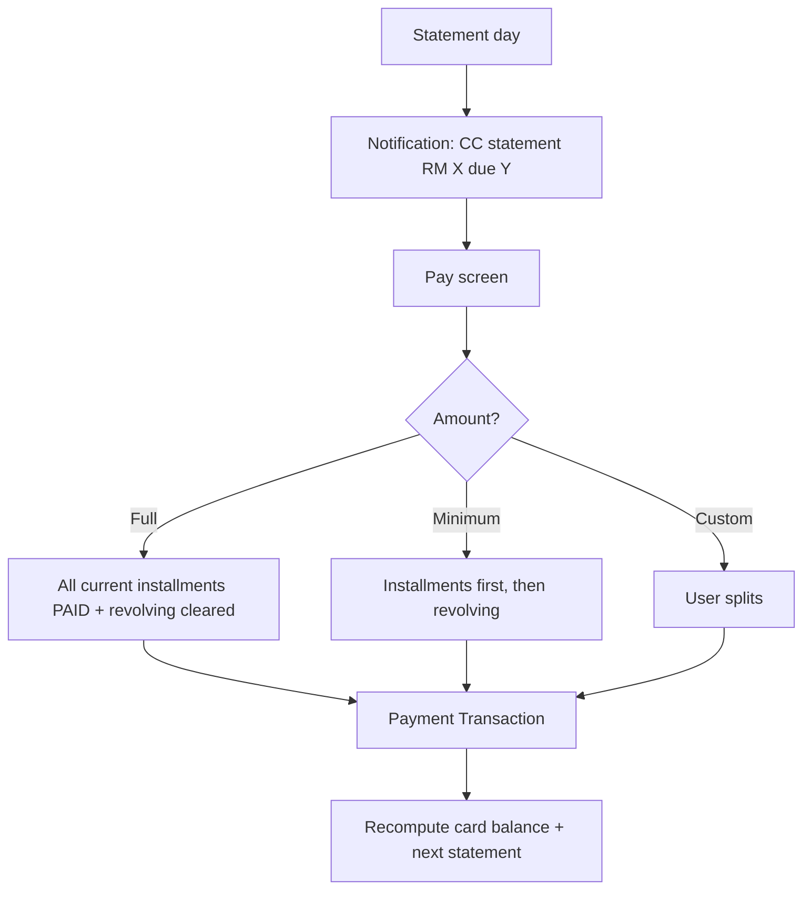
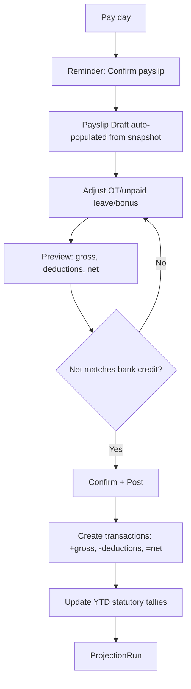
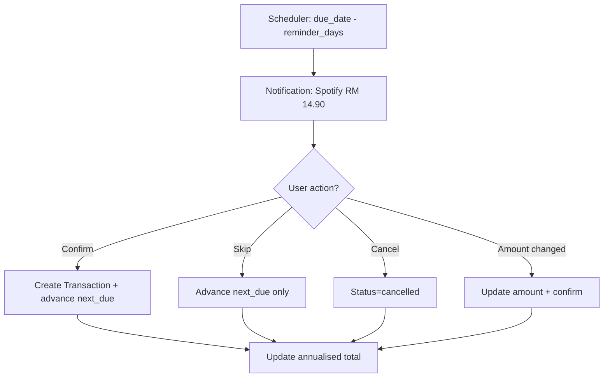
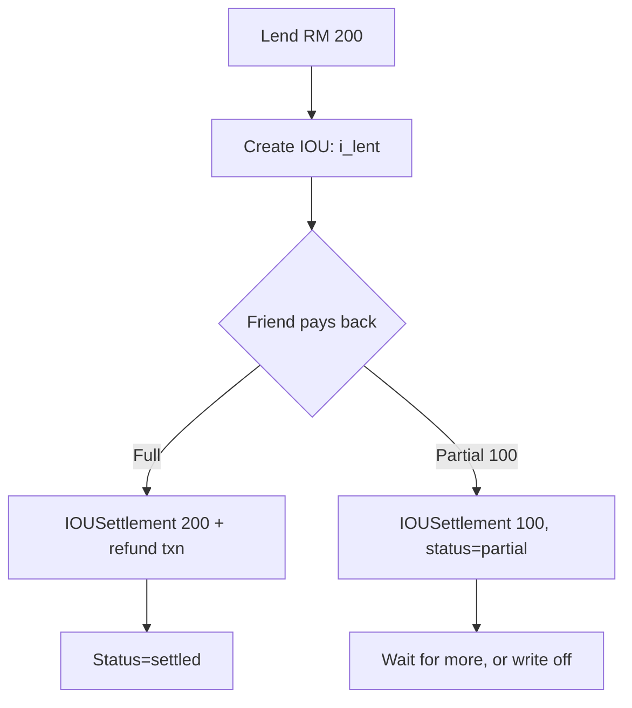
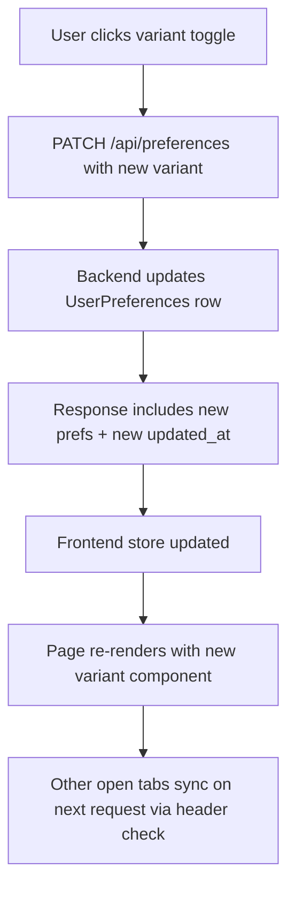

# WangKira — Personal Finance Tracker
**Application Plan v1.1**
**Owner**: Farzani Haikal · **Date**: 2026-05-13 · **Target completion**: rolling, MVP in ~13–15 weeks of evenings

> Working name: **WangKira** (*wang* = money, *kira* = count). Alternatives: Duit, Akaun, FinTrack. Rename globally before phase 0 if changing.

> **What's new in v1.1**: Display preferences as a first-class feature — Dashboard (3 variants), Accounts (2 variants), Budget (2 variants), all configurable in Settings with quick-toggle on each page.

---

## 1. Goals

### Primary
1. **Clear all debt** — chart projects clearance date; updated on every transaction.
2. **Track every ringgit** across CIMB (salary, bills), Maybank (daily spend), myASNB (ASB), KAF (parking), cash, credit cards, and BNPL (SPayLater / Atome / GrabPayLater).
3. **CC installments** — convert eligible purchases, generate amortisation schedule with interest, keep a paid-installment backlog.
4. **Budget by category** with monthly limits, burn-down, and category-level alerts.
5. **Subscriptions** — list, monthly/annual cost view, reminder before renewal.
6. **IOUs** — what people owe me, what I owe people; settlement closes both sides.
7. **Wedding fund** (target Aug 2028) progress and on-track indicator.
8. **Display flexibility** — switch between viewing modes that match daily mindset (focus, relax, drill).

### Secondary
- YTD statutory contribution view (EPF, SOCSO, EIS, PCB, zakat) for LHDN filing season.
- ASB dividend forecasting based on monthly balance.
- Net worth over time, separating liquid / restricted (ASB/EPF) / retirement (EPF employer).

---

## 2. Principles

| # | Principle | Why |
|---|-----------|-----|
| 1 | Accounts hold opening balance; current balance is computed from transactions | Single source of truth, audit-friendly |
| 2 | No floats for money — Decimal everywhere | Floats lose precision; financial errors compound |
| 3 | Versioned snapshots for time-varying rules | Historical accuracy when rates change |
| 4 | Recurring items prompt for confirmation, never auto-post | Catches cancelled subs, missed paydays |
| 5 | MYT for display, UTC stored | Consistent with PKIMS pattern |
| 6 | SQLite is the database; XLSX is a report, not state | One source of truth |
| 7 | Soft deletes only | Audit trail, accidental deletes recoverable |
| 8 | Every transaction is editable; corrections create reverse entries on confirmed payslips | Mistakes happen; data integrity preserved |
| 9 | Display variants share data and widgets; only layout differs | One data source; flexible UX |

---

## 3. Tech Stack

| Layer | Choice | Notes |
|-------|--------|-------|
| Backend | Python 3.11+ / Flask / SQLAlchemy | Matches PKIMS |
| Database | SQLite (WAL mode) | Single-file, easy backup |
| Money math | Python `decimal.Decimal`, frontend `decimal.js` | Never floats |
| Migrations | Alembic | Standard with SQLAlchemy |
| Scheduler | APScheduler in-process | Subscription/installment due checks |
| Frontend | React 18 + TypeScript, Vite, Tailwind | Matches existing tracker |
| Charts | Recharts | Already familiar |
| Dates | dayjs with `Asia/Kuala_Lumpur` plugin | MYT consistency |
| Testing | pytest + Vitest + Testing Library | |
| Packaging | Flask serves built React bundle on localhost | Single port, single process |
| Backup | Nightly SQLite VACUUM + dated copy to `/backups/` | Plus XLSX export |

---

## 4. Data Model

### 4.1 Accounts (polymorphic)

```sql
Account
  id, name, type, institution, currency, opening_balance, opening_date,
  status, display_order, color, icon, created_at, updated_at

AccountDebit       last_4, account_number_masked, linked_card_provider
AccountCreditCard  last_4, credit_limit, statement_day, due_day,
                   min_payment_pct, default_apr, cash_advance_apr, annual_fee
AccountBNPL        provider, credit_limit, default_tenure_options
AccountLoan        principal, apr, tenure_months, start_date,
                   monthly_installment, lender, account_number_masked
AccountSavings     last_4 (nullable), interest_rate, dividend_pattern, is_shariah
AccountCash        location
AccountInvestment  platform, holdings_json
```

**Seed accounts**: CIMB Current, Maybank Savings + Debit Card, myASNB, KAF Digital, Cash Wallet, real CCs/BNPL/loans (see §14).

### 4.2 Transactions

```sql
Transaction
  id, date, posted_date, account_id, type, amount, currency, fx_rate,
  category_id, subcategory_id, merchant, description, notes,
  counterparty_account_id, installment_id, source_for_installment_id,
  is_converted, tags, attachments, source, deleted_at,
  created_at, updated_at
```

Type enum: `expense`, `income`, `transfer`, `payment`, `refund`, `fee`, `interest`.

**Sign convention** (computed):
- `expense`/`payment`/`fee`/`interest` → negative on `account_id`
- `income`/`refund` → positive on `account_id`
- `transfer` → negative on `account_id`, positive on `counterparty_account_id`
- `payment` to debt account → negative on source, positive on debt account (reduces debt)

### 4.3 Categories

```sql
Category
  id, name, parent_id, type, icon, color, monthly_budget,
  rollover_policy, display_order, archived

BudgetSnapshot
  id, category_id, year_month, limit, rollover_from, notes
```

Preloaded taxonomy: Essentials (Need), Lifestyle (Want), People & Obligations, Debt Service, Savings & Goals, Subscriptions, Income.

### 4.4 Installments

```sql
Installment
  id, source_txn_id (UNIQUE), account_id, total_principal, tenure_months,
  apr, monthly_amount, conversion_date, first_due_date, status, notes

InstallmentSchedule
  id, installment_id, installment_no, due_date, principal, interest,
  total, status, paid_txn_id, paid_date
```

### 4.5 Subscriptions

```sql
Subscription
  id, name, vendor, amount, currency, frequency, custom_days,
  next_due_date, billing_account_id, category_id, reminder_days,
  auto_post, status, started_on, notes
```

### 4.6 IOUs

```sql
IOU
  id, direction, counterparty, amount, date, due_date, reason, status,
  settled_amount, notes

IOUSettlement
  id, iou_id, txn_id, amount, date
```

### 4.7 Salary & Payroll

```sql
SalarySetup
  id, employer_name, gross_monthly, pay_day, payout_account_id,
  effective_from, effective_to, active

PayrollDeduction
  id, salary_setup_id, type, calc_method, amount_or_pct,
  counts_in_net, counts_retirement, counts_health, active, notes

PayrollAllowance
  id, salary_setup_id, type, amount, taxable, epf_contributory

PayslipPosting
  id, salary_setup_id, pay_date, period_start, period_end, gross,
  total_allowances, total_deductions, net, snapshot_json, txn_ids,
  status, notes
```

Deduction types: `epf_employee`, `epf_employer`, `socso_employee`, `socso_employer`, `eis_employee`, `eis_employer`, `pcb`, `zakat_pcb`, `prs`, `medical`, `takaful`, `loan`, `parking`, `unpaid_leave`, `other`.

### 4.8 Income Sources (non-salary)

```sql
IncomeSource
  id, name, type, default_account_id, default_category_id,
  default_frequency, expected_next_date, expected_amount, active, notes
```

Presets: Annual Bonus, ASB Dividend, KAF Profit, FD Interest, Duit Raya, Birthday Angpow, Wedding Gift, Work Reimbursement, Freelance, Carousell Sale, CC Cashback, TnG Rebate, Tax Refund, Insurance Claim, Inheritance, Asset Sale, etc.

### 4.9 Debt Projection

```sql
ProjectionRun
  id, run_at, trigger, clearance_date, total_interest, strategy,
  extra_payment, snapshot_json
```

### 4.10 Recurring Rules

```sql
RecurringRule
  id, name, rule_type, amount, account_id, counterparty_account_id,
  category_id, frequency, next_run_date, auto_post, active, template_json
```

### 4.11 Audit Log

```sql
AuditLog
  id, timestamp, entity_type, entity_id, action, diff_json, reason
```

### 4.12 User Preferences (singleton)

```sql
UserPreferences  -- exactly one row, id=1
  id                       INTEGER PK
  -- Display variants
  dashboard_variant        ENUM(debt_forward, calm, dense)        DEFAULT 'calm'
  accounts_variant         ENUM(grid, list)                       DEFAULT 'grid'
  budget_variant           ENUM(table_bar, donut_grid)            DEFAULT 'table_bar'
  -- Theme & density
  theme                    ENUM(light, dark, system)              DEFAULT 'system'
  density                  ENUM(comfortable, compact)             DEFAULT 'comfortable'
  -- Money & date format
  hide_cents               BOOLEAN  DEFAULT FALSE
  show_currency_code       BOOLEAN  DEFAULT FALSE
  date_format              ENUM(dd_mmm_yyyy, dd_mm_yyyy, iso)     DEFAULT 'dd_mmm_yyyy'
  first_day_of_week        ENUM(mon, sun, sat)                    DEFAULT 'mon'
  -- Behaviour
  default_add_txn_account_id  INTEGER FK NULL
  default_add_txn_type        ENUM(expense, income, transfer)     DEFAULT 'expense'
  quick_toggle_enabled        BOOLEAN  DEFAULT TRUE
  -- Metadata
  updated_at               TIMESTAMP
```

Cached in memory at app boot; writes invalidate cache and broadcast `X-Preferences-Updated-At` header so multiple tabs sync.

---

## 5. Core Workflows

### 5.1 Add transaction



### 5.2 Convert CC purchase to installment



**Amortisation math** — standard reducing balance:
```
monthly_rate = apr / 12 / 100
monthly_payment = principal * monthly_rate / (1 - (1 + monthly_rate)^-tenure)
```
0% plans: `monthly_payment = principal / tenure`.

### 5.3 Pay CC statement



### 5.4 Payday posting



### 5.5 Subscription due



### 5.6 IOU lifecycle



### 5.7 Budget rollover (end-of-month job)

```
For each category:
  spent = sum(txns where category_id and year_month = closing month)
  if rollover_policy == accumulate:
    next.rollover_from = limit - spent  (can go negative)
  elif rollover_policy == reset:
    next.rollover_from = 0
  Create BudgetSnapshot for next month
```

### 5.8 Debt projection algorithm

```python
def project_clearance(strategy='snowball', extra=Decimal('0'), horizon_months=120):
    state = current_balances()
    monthly_disposable = avg_net_income(3) - avg_essential_spend(3) - extra
    timeline = []

    for month in range(horizon_months):
        # 1. Interest accrual on revolving CC and loans
        for debt in state.debts:
            if debt.revolving > 0:
                interest = debt.revolving * (debt.apr / 12 / 100)
                debt.revolving += interest

        # 2. Scheduled installment payments
        for inst in active_installments(month):
            apply_payment(inst.account, inst.monthly_amount)

        # 3. Minimum payments on revolving
        for cc in state.credit_cards:
            min_pay = max(cc.revolving * cc.min_payment_pct, MIN_RM_PAYMENT)
            apply_payment(cc, min_pay)

        # 4. Extra payment by strategy
        budget_left = monthly_disposable - sum_scheduled_above
        if budget_left > 0:
            target = pick_target(state.debts, strategy)
            apply_payment(target, budget_left)

        # 5. Project future CC spend
        for cc in state.credit_cards:
            cc.revolving += projected_new_spend(cc)

        timeline.append(snapshot(state, month))
        if state.total_debt <= 0:
            return ProjectionRun(clearance_date=month_from_now(month), timeline=timeline)

    return ProjectionRun(clearance_date=None, timeline=timeline)
```

### 5.9 PCB calculation (formula method)

```python
def compute_pcb(month, salary_setup, ytd):
    annualised = (month.gross_taxable * 12) - annual_reliefs
    bracket_tax = lhdn_bracket_tax(annualised)
    monthly_tax = (bracket_tax - rebates) / 12
    monthly_tax -= ytd.zakat_paid_this_cycle  # zakat reduces PCB rm-for-rm
    return max(Decimal('0'), monthly_tax)
```

### 5.10 Change display variant



Same flow for Settings page — Settings is a richer UI on the same endpoint.

---

## 6. Screens / UI Inventory

### 6.1 Dashboard (`/`) — 3 variants

User picks via `preferences.dashboard_variant`. Quick-toggle button top-right cycles through.

#### 6.1.1 Debt-forward variant
**Intent**: debt clearance is the central problem. Make the date impossible to ignore.

Layout:
- **Hero (top 50–60% of viewport)**: massive debt clearance card
  - Projected clear date in display-size font (e.g. `Aug 2027`)
  - Months remaining, with delta vs last week (`-2 weeks` in green if earlier)
  - Big debt trajectory chart with projection overlay
  - Strategy picker + what-if slider inline
- **Mid row (compact, three labelled numbers)**: Net Worth · This Month Spend · Wedding Fund
- **Bottom (compact list)**: Upcoming events, max 4 rows

Use when motivation matters and debt is the daily anchor.

#### 6.1.2 Calm/modular variant
**Intent**: low-anxiety daily check-in. Less data, more breathing room.

Layout:
- 2-column grid, 3 rows of large cards with generous padding (~`p-8`)
- Each card has one big focus number, soft shadow, rounded corners (`rounded-2xl`)
- Cards (6 total):
  1. Net Worth
  2. Debt Clearance (date only, no chart)
  3. This Month Spend (vs budget %)
  4. Wedding Fund (progress %)
  5. Next Event (single upcoming item)
  6. Quick Add (large CTA button)
- No micro-charts; muted color palette; large touch targets

Use when you don't want to feel overwhelmed.

#### 6.1.3 Dense/pro variant
**Intent**: terminal-style at-a-glance. Maximum signal, minimum scroll.

Layout:
- **Tile grid (4 cols × 2 rows = 8 tiles)** at top, ~120px tall each:
  Net Worth · Total Debt · Debt Clear Date · This Month Spend · Wedding Fund · Cash on Hand · ASB Balance · CC Utilisation %
- **Mid row (3 mini-charts side-by-side)**: Debt trajectory · Net worth 12mo · Category spend bars
- **Bottom (tabbed panel)**: Upcoming · Recent Transactions · Alerts (all default visible)
- Smaller fonts (~`text-sm`), tighter padding (`p-3`)
- Sparklines inside tiles for trend signal

Use when assessing everything at once on a desktop monitor.

**Shared widget components across all three**:
`NetWorthWidget`, `DebtClearanceWidget`, `BudgetBurnWidget`, `WeddingFundWidget`, `UpcomingEventsWidget`, `QuickAddWidget`, plus chart components `DebtTrajectoryMini`, `NetWorthSparkline`.

Variants compose these with different `size` and `density` props, plus variant-specific extras (the hero chart in debt-forward; sparklines in dense; minimal mode in calm).

### 6.2 Accounts (`/accounts`) — 2 variants

Quick-toggle button top-right.

#### 6.2.1 Grid variant
- Responsive grid: 2 cols mobile, 3 cols tablet, 4 cols desktop
- Each account is a card with:
  - Account icon + institution color band on top
  - Name + last_4 (`Maybank Visa •••• 1234`)
  - Big balance number
  - Type pill
  - Utilisation bar if credit_card or bnpl
- Hover: subtle lift (`hover:shadow-md hover:-translate-y-0.5`)
- Grouped by type with section headers + subtotals

#### 6.2.2 List variant
- Compact rows, table-style
- Columns: Icon · Name + last_4 · Type · Balance · Utilisation (CC/BNPL only) · Last activity
- Sortable column headers
- Group headers with type subtotals (sticky on scroll)
- Total at bottom of each group
- Higher density — 30+ rows visible on standard screen
- Better when many accounts

### 6.3 Transactions (`/transactions`)
Single layout (already dense by nature):
- Filter bar: date range, account, category, type, tags, search
- Grouped by date with daily totals
- Bulk select for re-categorise / tag / delete
- Quick-add FAB

### 6.4 Add Transaction (modal)
Triggered from FAB or `Cmd/Ctrl+N`.
- Type tabs: Expense / Income / Transfer / Payment (default per `preferences.default_add_txn_type`)
- Account picker (default per `preferences.default_add_txn_account_id`)
- Amount with calculator-style numpad
- Date (defaults today MYT)
- Merchant autocomplete from history
- Category auto-suggest from merchant
- Notes, tags, receipt attach
- For CC expense: "Convert to installment" toggle

### 6.5 Budget (`/budget`) — 2 variants

Quick-toggle button top-right.

#### 6.5.1 Table+Bar variant
- Month selector top
- Table with columns: Category · Budget · Spent · Remaining · Progress
- Progress is inline horizontal bar (green <80%, amber 80–100%, red >100%)
- Sortable by any column
- Inline edit on Budget column (click → input → save on blur)
- Row click → drill to transactions filtered by category+month
- Footer with totals

Best when adjusting budgets or analysing numbers.

#### 6.5.2 Donut+Grid variant
- Month selector top
- Big donut chart showing actual spend share by parent category (Essentials / Lifestyle / etc.)
- Donut center shows: "Spent RM X of RM Y" with overall progress
- Below donut: grid of category cards (3–4 per row)
  - Each card has mini ring (% of limit used)
  - Category name, remaining amount
  - Color-coded by status
- Click card → drill to transactions

Best for visual scanning and overall feel of the month.

### 6.6 Installments (`/installments`)
- Tabs: Active / Backlog (completed) / All
- Each item: source transaction, monthly amount, progress (X/Y paid)
- Expand → full schedule table with paid/pending rows
- Convert a past CC purchase from here too

### 6.7 Subscriptions (`/subscriptions`)
- Active list with next due, amount, frequency
- Annualised total card at top
- Add / Edit / Pause / Cancel
- Audit trail of past renewals

### 6.8 IOUs (`/ious`)
- Tabs: They owe me / I owe / All / Settled
- Row: counterparty, amount outstanding, days open, due date
- Quick settle → modal with amount + account picker
- Write-off with reason

### 6.9 Salary (`/salary`)
- Salary setup card: gross, employer, pay day
- Deductions list (editable)
- Allowances list
- Latest payslip card
- History list with audit trail
- YTD tile: EPF, SOCSO, EIS, PCB, zakat, gross, net

### 6.10 Reports (`/reports`)
- Tabs for: Net Worth, Income/Expense, Categories, Debt Trajectory, Subscriptions, Income Sources, Statutory YTD
- Each chart has export button

### 6.11 Settings (`/settings`)
Sections:
1. **Accounts** — manage accounts
2. **Categories** — manage taxonomy + budgets
3. **Display Preferences** — see §6.11.1
4. **Tax Profile** — reliefs for PCB
5. **Salary Setup** — link to §6.9
6. **Recurring Rules**
7. **Backup & Restore**
8. **Data Export** — XLSX
9. **Audit Log Viewer**

#### 6.11.1 Display Preferences section

A dedicated card group letting the user set every preference. For each variant choice, show a thumbnail preview (small SVG illustration) + radio selector. Layout:

- **Dashboard layout** — three thumbnail cards side-by-side (`debt_forward` / `calm` / `dense`)
- **Accounts layout** — two thumbnails (`grid` / `list`)
- **Budget layout** — two thumbnails (`table_bar` / `donut_grid`)
- **Theme** — `light` / `dark` / `system` (radio)
- **Density** — `comfortable` / `compact` (radio, global modifier on lists/tables)
- **Hide cents** — toggle (when on, displays RM 1,234 instead of RM 1,234.56)
- **Date format** — three options with preview
- **First day of week** — Mon / Sun / Sat
- **Default add-transaction account** — picker
- **Default add-transaction type** — radio
- **Quick toggle on pages** — toggle (if user dislikes the in-page toggle button)

Settings update is immediate (no Save button); reverts within 24h are auditable in Audit Log.

### 6.12 Quick toggle UX

When `preferences.quick_toggle_enabled = true`:
- Dashboard, Accounts, Budget each show a small icon button top-right (next to page title)
- Icon represents current variant; click cycles to next variant for that page
- `V` keyboard shortcut also cycles variant on the current page (if applicable)

When `quick_toggle_enabled = false`, icon and shortcut are disabled. Changes only via Settings.

---

## 7. Build Phases

| Phase | Goal | Variant work included |
|-------|------|----------------------|
| **P0** Foundation | Schema, models, base shell, **UserPreferences singleton** | Pref model + API + frontend hook |
| **P1** Transactions & Accounts | CRUD, balance computation | **Accounts grid + list variants**, quick-toggle |
| **P2** Categories & Budget | Budget CRUD, rollover | **Budget table+bar + donut+grid variants**, quick-toggle |
| **P3** Subscriptions & IOUs | Reminders, lifecycle | — |
| **P4** CC Installments | Amortisation, statement view | — |
| **P5** Salary & Payroll | EPF/SOCSO/EIS/PCB, payslip flow | — |
| **P6** Projection & Dashboard | Engine + **all 3 dashboard variants**, quick-toggle | Dashboard variants |
| **P7** Reports, Backup, Polish | Charts, XLSX, backup, **Display Preferences UI in Settings** | Settings preference UI |

---

## 8. Algorithms — Detailed Specs

### 8.1 EPF
| Gross monthly | Employee | Employer |
|---------------|----------|----------|
| ≤ RM 5,000    | 11%      | 13%      |
| > RM 5,000    | 11%      | 12%      |

Rounded up to next ringgit per Third Schedule.

### 8.2 SOCSO
Lookup table (Category I, employees <60). ~0.5% employee + ~1.75% employer up to ~RM 6,000 insured wage cap.

### 8.3 EIS
Lookup table. ~0.2% each side, same cap.

### 8.4 PCB — formula method
```
MTI = gross - EPF (capped RM 4,000/y for relief) - SOCSO - approved deductions
Estimated annual taxable = MTI * remaining months + YTD taxable - reliefs
Tax on estimated annual = bracket_calc(estimated_annual)
PCB = (tax_on_annual - tax_paid_ytd - rebates - zakat_paid) / remaining months
PCB = max(0, PCB)
```

Brackets (YA 2024+, verify before P5):
```
0–5,000:           0%
5,001–20,000:      1%   on excess over 5,000 (+ RM 0)
20,001–35,000:     3%   on excess over 20,000 (+ RM 150)
35,001–50,000:     6%   on excess over 35,000 (+ RM 600)
50,001–70,000:     11%  on excess over 50,000 (+ RM 1,500)
70,001–100,000:    19%  on excess over 70,000 (+ RM 3,700)
100,001–400,000:   25%  on excess over 100,000 (+ RM 9,400)
400,001–600,000:   26%  on excess over 400,000 (+ RM 84,400)
600,001–2M:        28%  on excess over 600,000 (+ RM 136,400)
>2M:               30%
```

### 8.5 Installment amortisation
```python
def amortise(principal, apr, tenure):
    r = Decimal(apr) / Decimal(12) / Decimal(100)
    if r == 0:
        monthly = principal / tenure
        return [(i, monthly, Decimal(0), monthly) for i in range(1, tenure+1)]
    monthly = principal * r / (1 - (1 + r) ** -tenure)
    schedule = []
    balance = principal
    for i in range(1, tenure + 1):
        interest = balance * r
        princ = monthly - interest
        balance -= princ
        schedule.append((i, princ, interest, monthly))
    return schedule
```
Round 2dp `ROUND_HALF_EVEN`. Final row absorbs rounding diff.

### 8.6 Net worth
```
Net Worth = sum(all account balances)
  debit/savings/cash/investment: opening + sum(transactions)
  credit_card/bnpl/loan: -(opening + sum(unpaid charges + installment balances + interest))
```
Breakdowns: Liquid · Restricted · Retirement · Debt.

---

## 9. UX Conventions

- **Color**: green positive/on-track; red debt/overspend; amber warning; blue info
- **Currency display**: `RM 1,234.56` default; respects `hide_cents` preference
- **Date display**: respects `date_format` preference (default `13 May 2026`)
- **Numbers**: always thousands separator
- **Empty states**: every screen has illustrated empty state with onboarding hint
- **Confirmation**: destructive actions require typed confirmation
- **Keyboard shortcuts**: `Cmd/Ctrl+N` new transaction; `Cmd/Ctrl+F` search; `Cmd/Ctrl+,` settings; `V` cycle variant on current page
- **Density**: global `density` preference scales padding/font on dense surfaces (lists/tables) but not on focus-number cards
- **Theme**: light/dark/system; respects OS when `system`
- **Mobile**: responsive but mobile is a P8 polish target

---

## 10. Testing Strategy

### Backend (pytest)
- Unit: Decimal math (amortisation, PCB, EPF, projection step)
- Integration: SQLAlchemy session per test, factory_boy
- Critical paths: transaction → audit; installment conversion → reversal; payslip post → atomic
- Preferences: PATCH only-supplied-fields, cache invalidation, default behaviour

### Frontend (Vitest + RTL)
- Component: render + interaction for Add Transaction modal, BudgetBar, AccountCard, AccountRow
- **Variant tests**: each dashboard/accounts/budget variant renders correctly with sample data
- Integration: balance updates after transaction; variant change persists across page refresh
- E2E (Playwright, optional, P7): full flow incl. variant switching

### Data integrity tests
- Sum of all transactions = (sum of current balances - sum of opening balances)
- Installment schedule total = source amount + total interest
- Payslip gross - deductions = net = posted transaction sum

---

## 11. Backup & Recovery

- **Nightly**: APScheduler 03:00 MYT → VACUUM INTO `/backups/wangkira-YYYY-MM-DD.db`
- **Retention**: 30 daily, 12 monthly, unlimited yearly
- **Weekly cloud sync**: copy newest to OneDrive/GDrive (manual setup)
- **Restore UI**: Settings → Restore → pick file → typed confirmation → swap DB → restart
- **XLSX export**: full dump, MYT timestamps, one sheet per entity

---

## 12. Repo Structure

```
wangkira/
├── backend/
│   ├── app/
│   │   ├── __init__.py
│   │   ├── config.py
│   │   ├── models/
│   │   │   ├── account.py
│   │   │   ├── transaction.py
│   │   │   ├── category.py
│   │   │   ├── installment.py
│   │   │   ├── subscription.py
│   │   │   ├── iou.py
│   │   │   ├── salary.py
│   │   │   ├── income.py
│   │   │   ├── projection.py
│   │   │   ├── preferences.py
│   │   │   ├── tax_profile.py
│   │   │   ├── notification.py
│   │   │   ├── recurring.py
│   │   │   └── audit.py
│   │   ├── schemas/
│   │   ├── api/
│   │   ├── services/
│   │   │   ├── projection.py
│   │   │   ├── amortisation.py
│   │   │   ├── pcb.py
│   │   │   ├── statutory/
│   │   │   ├── budget.py
│   │   │   └── preferences.py
│   │   ├── scheduler.py
│   │   └── seed/
│   ├── migrations/
│   ├── tests/
│   ├── requirements.txt
│   └── run.py
├── frontend/
│   ├── src/
│   │   ├── api/
│   │   ├── components/
│   │   │   ├── dashboard/
│   │   │   │   ├── DashboardDebtForward.tsx
│   │   │   │   ├── DashboardCalm.tsx
│   │   │   │   ├── DashboardDense.tsx
│   │   │   │   └── widgets/         # shared widgets
│   │   │   ├── accounts/
│   │   │   │   ├── AccountsGrid.tsx
│   │   │   │   └── AccountsList.tsx
│   │   │   ├── budget/
│   │   │   │   ├── BudgetTableBar.tsx
│   │   │   │   └── BudgetDonutGrid.tsx
│   │   │   ├── settings/
│   │   │   │   └── DisplayPreferences.tsx
│   │   │   └── ...
│   │   ├── pages/
│   │   ├── hooks/
│   │   │   ├── usePreferences.ts
│   │   │   └── ...
│   │   ├── lib/
│   │   ├── App.tsx
│   │   └── main.tsx
│   ├── package.json
│   ├── tsconfig.json
│   └── vite.config.ts
├── backups/
├── docs/
│   ├── APPLICATION_PLAN.md
│   ├── EXECUTION_PLAN.md
│   └── decisions/
└── README.md
```

---

## 13. Open Questions — Provisional Decisions

| # | Question | Decision | Rationale | Reversible? |
|---|----------|----------|-----------|-------------|
| 1 | Tech stack | Flask + SQLite + React (TS) | Matches PKIMS | Hard once built |
| 2 | Multi-device sync | No, single + manual backup | YAGNI v1 | Yes, P8 |
| 3 | Statement import | Manual first, CSV in P8 | Manual forces hygiene | Yes |
| 4 | CC installment credit reservation | Reserve full on conversion | Matches Maybank | Yes |
| 5 | Projection default strategy | Snowball | Psychological wins | Yes |
| 6 | PCB calculation | Formula method | Maintainable | Yes |
| 7 | Zakat handling | Both modes (PCB or lump-sum) | Real-world mixed | Yes |
| 8 | Bonus pattern | Configurable per SalarySetup | No contract assumption | Yes |
| 9 | Employer EPF | Tracked as "retirement pot" | Visible but flagged | Yes |
| 10 | Recurring auto-post | Default off, prompt | Catches cancellations | Per-rule toggle |
| 11 | **Default dashboard variant** | **`calm`** | **Daily use more common than analysis** | Yes — instant switch |
| 12 | **Default accounts variant** | **`grid`** | **Visual, friendlier for first use** | Yes |
| 13 | **Default budget variant** | **`table_bar`** | **More common, analytical** | Yes |
| 14 | **Variant persistence** | **Server-side singleton table** | **Single source of truth** | Yes |
| 15 | **Quick toggle visibility** | **On by default** | **Discoverability of variant feature** | User can disable |

---

## 14. Data You'll Need to Provide Before Phase 0

- [ ] Credit cards: bank, last_4, credit limit, statement day, due day, default APR
- [ ] BNPL: providers in use, credit limits
- [ ] Active loans: lender, principal remaining, APR, monthly installment, end date
- [ ] Salary: gross, pay day, employer, current EPF rate, current PCB amount (from payslip)
- [ ] Tax reliefs: marital status, dependants, any specific reliefs claimed
- [ ] Current ASB / KAF balances
- [ ] Active subscriptions: name, amount, frequency, next due
- [ ] Recurring bills: TNB, Air, Unifi, mobile, insurance — average, due day, paying account
- [ ] Active IOUs in either direction
- [ ] Active CC installments mid-flight: source amount, tenure, APR, months paid
- [ ] Wedding fund current balance and target
- [ ] **Display preference defaults** (or accept §13.11–13.13)

---

## 15. Definition of Done — MVP

1. Every real account is in the app with correct opening balance
2. One full pay cycle recorded (payslip → all deductions → net to CIMB)
3. One month of daily transactions entered and balances reconcile to bank apps to the sen
4. Budget for current month set across all categories
5. At least one active subscription firing reminders
6. At least one CC purchase converted to installment
7. Dashboard shows projected debt clearance date
8. XLSX export of full month runs in <5 seconds
9. Nightly backup successfully run for ≥7 days
10. **All three dashboard variants render and switch via quick-toggle**
11. **Both account variants render and switch via quick-toggle**
12. **Both budget variants render and switch via quick-toggle**
13. **Display Preferences UI in Settings is functional and persists across restart**

---

## 16. Out of Scope (v1)

- Multi-user / spouse access
- Cloud sync
- Bank API integration
- Investment performance tracking (only balances)
- Insurance policy management
- Tax filing automation
- Mobile native app
- Currency conversion beyond manual fx_rate field
- Crypto holdings beyond a single line item
- Custom variant builder (variants are fixed; configuration only, not custom layouts)
- Additional variants beyond the 3+2+2 set in v1.1

---

## 17. Risks & Mitigations

| Risk | Likelihood | Impact | Mitigation |
|------|------------|--------|------------|
| Forgetting to log cash spend | High | Med | Quick-add FAB; weekly cash reconciliation prompt |
| PCB calculation drift vs LHDN | Med | Med | Manual override field on payslip; annual review |
| Decimal precision bugs | Med | High | All math in services/ with unit tests; never floats |
| Backup file corruption | Low | High | Verify hash post-backup; retain 30 days |
| Projection assumptions wrong | High | Low | Show "current pace" and "if no new spend" |
| Time sink vs YNAB | Med | High | Constrain phases; ship MVP in ~14 weeks |
| **Variant proliferation** | **Med** | **Med** | **Lock variant list at v1.1; new variants only at planned v2** |
| **Shared widget drift across variants** | **Med** | **Med** | **Strict prop contracts; render tests per variant** |
| **Building 3 dashboards before MVP exists** | **Med** | **High** | **Calm variant ships first as P6 critical path; debt-forward + dense gated as P6.5/P7 work** |

---

## 18. References

- LHDN PCB Schedule: https://www.hasil.gov.my (verify YA 2026 before P5)
- KWSP Contribution Rates: https://www.kwsp.gov.my
- PERKESO Contribution Tables: https://www.perkeso.gov.my
- Existing patterns: PKIMS HLD v0.5.x, finance tracker (React/IndexedDB)

---

**Next action**: confirm §13 decisions (especially 11–15 for variant defaults), provide §14 data, then I generate phase 0 schema + seed.
